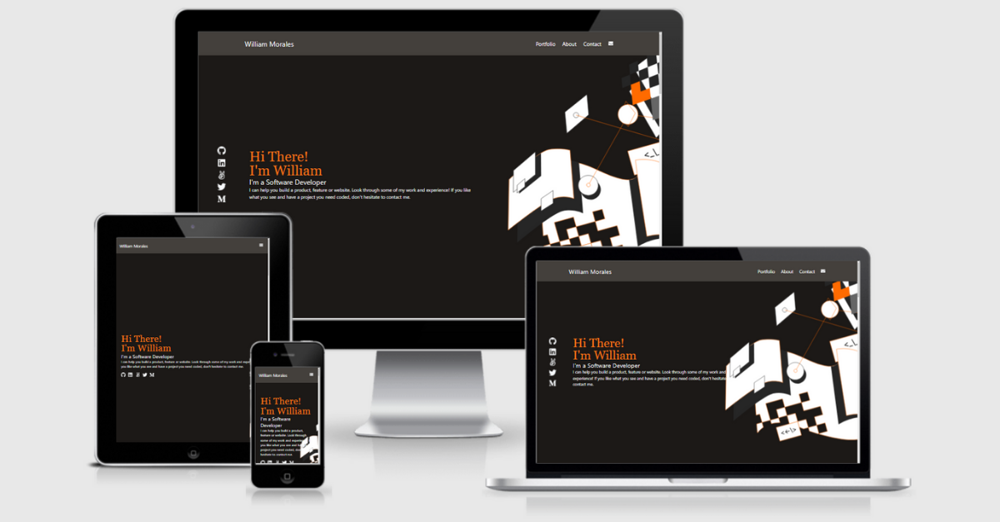

# My Personal Portfolio

This is my personal portfolio repository, open the live preview and take a look of my best works

This projects use some of the best practiques in accesibility design and responsive design. Feel free to watch all the linked projects and navigate to its repository

<!-- ### 🖥️ Desktop version -->

<!-- Include some screenshots of desktop version -->

<!-- ### 📱 Mobile version -->

<!-- Include some screenshots of mobile version -->

<!-- ## ✅ Learning objectives

- objective 1
- objective 2
- objective 3 -->

## 🧩 Built With

- Javascript
- React.js
- Vite.js
- TailwindCSS
- Netlify

## 📚 Getting Started

To get a local copy up and running follow these simple example steps.

### Prerequisites

For this project you don't need aditional tools

<!-- For this project to run you will need the following tools:
- requisite -->

### Setup

Fork a copy to your repository

### Install

Clone the repository on your local enviroment and run `npm i` on your terminal

### Usage

To start the dev server just run `npm run dev`.
You can work in your favorite Code Editor

## 💻📱 Live Preview

<!-- There is no Live Demo available at the moment -->

If you want to see a live demo of this project, [click here](https://loving-wescoff-fd28de.netlify.app/)

## Authors

👤 **William Morales**

- GitHub: [@williamrolando88](https://github.com/williamrolando88)
- Twitter: [@WillyMorales93](https://twitter.com/WillyMorales93)
- LinkedIn: [William Morales](https://www.linkedin.com/in/william-morales-palma/)

## 🤝 Contributing

Contributions, issues, and feature requests are welcome!

Feel free to check the [issues page](../../issues).

## 👏 Show your support

Give a ⭐️ if you like this project!

<!-- ## 👍 Credits -->

<!--
GUI & Graphic Design: Cindy Shin

- Behance: [Cindy Shin](https://www.behance.net/adagio07)
-->

## 📝 License

Copyright (c) 2022 William Morales

Permission is hereby granted, free of charge, to any person obtaining a copy of this software and associated documentation files (the "Software"), to deal in the Software without restriction, including without limitation the rights to use, copy, modify, merge, publish, distribute, sublicense, and/or sell copies of the Software, and to permit persons to whom the Software is furnished to do so, subject to the following conditions:

The above copyright notice and this permission notice shall be included in all copies or substantial portions of the Software.

THE SOFTWARE IS PROVIDED "AS IS", WITHOUT WARRANTY OF ANY KIND, EXPRESS OR IMPLIED, INCLUDING BUT NOT LIMITED TO THE WARRANTIES OF MERCHANTABILITY, FITNESS FOR A PARTICULAR PURPOSE AND NONINFRINGEMENT. IN NO EVENT SHALL THE AUTHORS OR COPYRIGHT HOLDERS BE LIABLE FOR ANY CLAIM, DAMAGES OR OTHER LIABILITY, WHETHER IN AN ACTION OF CONTRACT, TORT OR OTHERWISE, ARISING FROM, OUT OF OR IN CONNECTION WITH THE SOFTWARE OR THE USE OR OTHER DEALINGS IN THE SOFTWARE.
